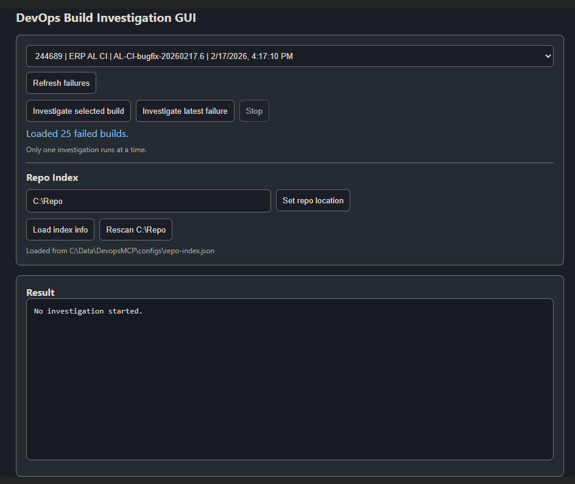

# DevOps MCP Investigator

MCP server + AI agent for investigating Azure DevOps build failures, mapping failures to local code, and proposing/fixing issues when possible.

## What this repo does

- Exposes Azure DevOps investigation tools through an MCP server
- Runs an AI investigation agent (CLI or GUI)
- Connects build failures to local repositories on disk
- Supports build triage, logs/timeline analysis, and follow-up actions

## Project structure

- `src/server/` — MCP server and Azure DevOps tool implementations
- `src/agent/` — AI agent loop, tool execution, local file tools
- `src/gui/` — Local web UI for running investigations
- `src/tools/repo-index.ts` — Repo scanner that builds `configs/repo-index.json`
- `configs/repo-index.json` — Editable repository lookup index used by the agent

## Prerequisites

- Node.js 20+
- Access to Azure DevOps project and PAT
- Local source repositories available (default root: `C:\Repo`)

## Environment variables

Required:

- `ADO_PAT` — Azure DevOps Personal Access Token
- `AZURE_OPENAI_KEY`
- `AZURE_OPENAI_ENDPOINT`
- `AZURE_OPENAI_DEPLOYMENT`

Optional:

- `ADO_ORG` (default: `fictional-org`)
- `ADO_PROJECT` (default: `FictionalProject`)
- `ADO_PROJECT_URL` (default: `https://dev.azure.com/<ADO_ORG>/<ADO_PROJECT>/`)
- `AZURE_OPENAI_API_VERSION` (default: `2024-05-01-preview`)
- `REPO_BASE_PATH` (default: `C:\Repo`)
- `REPO_INDEX_PATH` (default: `configs/repo-index.json`)
- `GUI_PORT` (default: `4230`)

## Install

```bash
npm install
```

## Build

```bash
npm run build
```

## Generate / refresh repo index

Scans `C:\Repo` and writes `configs/repo-index.json`:

```bash
npm run index:repo
```

## Run options

### 1) GUI (recommended)

```bash
npm run dev:gui
```

Open `http://localhost:4230`

## Screenshot

Add your UI screenshot to `docs/gui-overview.png` and it will render here:



GUI features:

- Select a failed build or investigate latest failure
- Live streaming investigation output
- Stop running investigation
- Follow-up option buttons (numbered, clickable)
- Repo index status/actions (load info, set repo location, rescan)

## Quick demo flow

1. Start the GUI:

	```bash
	npm run dev:gui
	```

2. Open `http://localhost:4230`
3. Click **Refresh failures**
4. Select a failed build from the dropdown
5. Click **Investigate selected build**
6. Watch live output in **Result**
7. If follow-up choices appear, click a numbered option to continue
8. Use **Stop** to cancel a running investigation
9. (Optional) Change **Repo location** in the top panel
10. Click **Rescan C:\Repo** (or your new path) to refresh lookup roots after changing location

### 2) CLI Agent

```bash
npx tsx src/agent/index.ts --latest-failure
```

Examples:

```bash
npx tsx src/agent/index.ts --build 244683
npx tsx src/agent/index.ts --latest-failure --pipeline "ERP AL Incremental"
npx tsx src/agent/index.ts --investigate "Why did the last full build fail?"
```

### 3) MCP Server only

```bash
npm run dev:server
```

## NPM scripts

- `build` — TypeScript compile
- `start:server` — run built MCP server
- `start:agent` — run built agent
- `start:gui` — run built GUI
- `dev:server` — run server from source with `tsx`
- `dev:agent` — run agent from source with `tsx`
- `dev:gui` — run GUI from source with `tsx`
- `index:repo` — regenerate repo index from local repo root

## How repo lookup works

The agent uses `configs/repo-index.json` to determine lookup roots for local tools (`read`, `grep`, `search`, etc.).

- Edit `configs/repo-index.json` directly if needed
- You can also set the repo location from the GUI top panel
- After changing the repo location, a rescan is required to refresh lookup paths
- Run `npm run index:repo` to refresh from disk
- Tool `local_get_repo_index` is available to the agent for runtime inspection

## Notes

- The UI and CLI are designed for iterative investigation and follow-up actions
- Build logs can be large; timeline + summary tools are used first for triage
- Root-cause fixes should be validated in source repos before merge
